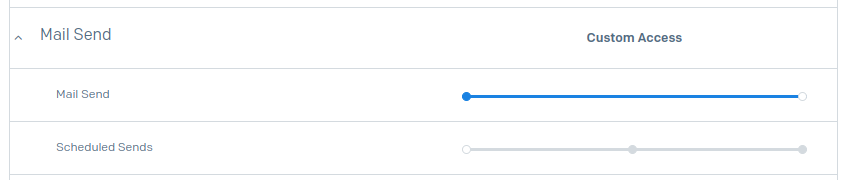

# README

A simple express app that handles contact form submissions and sending an email to the site owner

## `dotenv` required configuration

**Be extremely careful with your API token; mail services such as Sendgrid, Mailgun and others automatically-detect if you inadvertently 
expose your API token**. While this is useful for security purposes, _you will be locked out of using your account until you've taken measures
to secure your account_.

**Always be sure to add all `*.env*` files to your `.gitignore` file.**

```
SENDGRID_API_KEY=<sendgrid_api_key_with_mail_send_access>
SENDER_EMAIL=<automated_sender_email_address>
CONTACT_EMAIL=<your_email_address>
```

## Generating your SendGrid API Key

Once you have signed up for a SendGrid account, click "Settings" > API Keys. Then, click "Create API Key".

Select the following access level:


Then, you **only** need to enable the following setting for this API key, since all it will be doing is sending mail:


